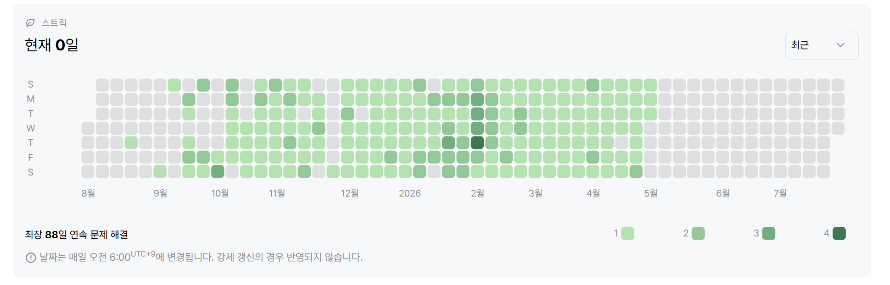

# 안녕하세요. 천기오입니다.

▎ 저는 진짜 문제가 무엇인지, 왜 해야 하는지를 먼저 고민합니다. <br>
▎ 널리 쓰이는 기술도 정말 제 상황에 적절한지 따져보고, 더 쉽고 단순한 방법이 있으면 그쪽을 택합니다.

<br>

## 🕒 Timeline

<table>
<tr><td width="160"><b>2019.03 – 2025.02</b></td><td>🎓 성균관대학교 소프트웨어학과 <i>(전공 4.31 / 4.5 · 우등 졸업)</i></td></tr>
<tr><td><b>2024.09 – 2024.12</b></td><td>💼 주식회사 위븐 인턴십 — SI 웹개발</td></tr>
<tr><td><b>2025.03 – 2025.08</b></td><td>📚 [KB] IT's Your Life 6기 수료, <i>우수 훈련생 수상</i></td></tr>
<tr><td><b>2026.01 – 진행중</b></td><td>🚀 SSAFY 15기(Java 전공), 1학기 성적 우수 수상</td></tr>
</table>

**자격 / 인증** &nbsp;`정보처리기사` `SQLD` `삼성전자 SW 역량테스트 B형(Professional)` `TOPCIT`

<br>

## 🛠 Stack

**Backend**     

**Frontend**  

**Infra / Tools**   

<br>

## 🧩 Algorithm

매일 문제를 푸는 루틴을 유지하고 있습니다. 알고리즘은 주어진 제약 안에서 무엇을 포기할지 고르는 훈련이라고 생각합니다. 그렇게 쌓인 감각이 코드를 검증하고 더 나은 방법을 제안할 때 쓰입니다.

[](https://solved.ac/heelun8525)


[**[KB] IT's Your Life 코딩테스트 스터디 Repository**](https://github.com/KB-ITL-CodingTest) (2025-03 ~ 2025-06)
<br>
[**SSAFY 코딩테스트 스터디 Repository**](https://github.com/gwamul/ssafy_13_coding_test) (2026-02 ~ 2026-04)
<br>

## 🤝 협업 방식

- 팀원이 가져다 쓸 기반을 만드는 역할 — 각자 만든 중복 컴포넌트를 공통으로 합치고, 커진 화면을 책임 단위로 쪼갰습니다. 기능이 끝난 뒤 몰아서가 아니라 진행 중에 계속 다듬는 편이라, 세 프로젝트에서 이 역할을 반복해 맡았습니다.
- 프로젝트의 빈틈을 메우는 역할 — 드러나지 않은 위험은 없는지 살피고, 회색지대에 남은 일을 상기시키는 편입니다. 팀원들에게 "거기까지 생각 못 했다"는 말을 들을 때가 많았습니다.
- 판단 근거를 남기는 커밋과 PR — 무엇을 왜 바꿨는지 기능 단위로 나눠 적고, 구조를 바꿀 때는 왜 다른 방법을 안 골랐는지까지 함께 적습니다. PR은 작업 내역 / 변경 사항 / 테스트 플랜 형식으로 씁니다.

<br>

## 🤖 AI를 개발에 들이는 방식

처음엔 AI를 부분적으로만 썼습니다. 같은 입력에도 다른 답을 내는 확률적 특성을 믿기 어려웠고, 예기치 못한 사고로 이어질 위험이 크다고 봤기 때문입니다. 그런데 최근 프로젝트에 조금씩 들여보니 결과가 생각보다 훨씬 좋았고, 관점이 바뀌었습니다 — **사람도 실수하고 AI도 실수한다면, 생산성이 높은 쪽을 쓰되 틀린 부분을 짚어낼 수 있으면 되지 않나.**

그래서 AI를 그냥 쓰는 게 아니라 신뢰할 수 있는 구조를 만드는 데 집중했습니다. 반복해 쓰는 작업은 스킬로 만들고, AI가 반복해서 실수하는 부분은 시스템 프롬프트로 못 박고, 중간 과정을 계속 검토하며 워크플로우 자체를 다듬어 갑니다.

> 🔗 이 과정을 정리한 개인 설정을 공개해 두었습니다 — [**claude-dotfiles**](https://github.com/CheonKiO/claude-dotfiles)

이 변화는 테스트에 대한 생각도 바꿨습니다. TDD의 가장 큰 걸림돌은 늘 생산성이었는데, AI가 테스트 작성 비용을 크게 낮추면서 그 부담이 사라졌습니다. 실제로 테스트를 먼저 두르고 개발해보니 **직접 손으로 짤 때보다 오히려 실수가 줄었고**, 검증 가능한 구조가 사고를 미리 막는다는 걸 겪어서 알게 됐습니다.

<br>

---

# 💼 Experience

## 주식회사 위븐 — 개발팀 인턴 (2024.09 ~ 2024.12)

ICT 학점연계 프로젝트로 참여한 SI 웹개발 인턴십입니다. **실제 클라이언트에게 납품되는 서비스**를 다룬 첫 경험이었습니다.

**담당 업무**

- 한국MICE협회 웹사이트 개발 및 유지보수
- Artitutor(발레 온라인 수강 · 콩쿨 신청 플랫폼) 기능 개발
- AI 기반 웹빌더 Zaemit / Z-Studio QA

**사용 기술** &nbsp;`jQuery` `PHP` `MariaDB` `Git` `Docker`

### 여기서 배운 것

jQuery와 PHP 기반의 사내 프레임워크 위에서 개발해야 했는데, 언어도 생소하고 프레임워크라는 개념 자체가 처음이라 각 함수가 어떤 역할을 하고 데이터가 어떻게 흐르는지 파악하는 데 초반 시간을 많이 썼습니다. 출력문으로 짐작하는 대신 브라우저 중단점과 PHP 디버거로 실행을 따라가며 확인하는 방식에 익숙해지기도 했습니다. 기존 코드의 흐름과 회사 컨벤션에 맞춰 개발하는 법을 배웠고, 이론과 다른 선택이 실무에서 쓰일 수 있음을 직접 겪으며, 트레이드오프를 더 깊게 생각하게 됐습니다.

<br>

인턴십 도중, 제 선에서 처리할 수 없는 일을 하루 종일 붙들고 있다가 일정을 늦춘 적이 있습니다. 협업에서는 무엇보다 빠른 소통이 중요하다는 걸 깨닫고, 그 뒤로는 막히거나 의문이 생기면 바로 팀과 공유합니다.

---

# 📌 Projects

<br>

## 🏠 LightHouse — 사회초년생을 위한 부동산 안심 진단 서비스 (2025-07 ~ 2025-08)

> **6인 팀 (전공자 4 · 비전공자 2) · 2개월 · KB IT's Your Life 6기 Final**
> 담당: 실거래가 외부 API 연동 구조, 동네 검색 성능 개선, 관심 목록, 공용 컴포넌트, 백엔드 환경 구성, 설치 가이드
> [Backend](https://github.com/KB-its-your-life-Final-Project/FinalProjectBack) · [Frontend](https://github.com/KB-its-your-life-Final-Project/FinalProjectFront)


전세사기 피해자의 75%가 2030이라는 데이터에서 출발해, 주소만 넣으면 실거래가·건축물대장·재정 안정성을 종합한 안심 리포트를 주는 서비스입니다. 규모 있는 데이터를 처음 다뤄본 실전 팀 프로젝트였습니다.

`Java 17` `Spring Framework 5.3.38` `MyBatis` `MySQL` `Spring Security` `JWT` `Vue 3` `TypeScript` `공공데이터포털` `CODEF` `Naver Cloud`

### 🔍 무엇을 고민했나

#### 비슷한 API 8개의 공통 인터페이스 생성

공공데이터 API의 아파트 / 연립다세대 / 오피스텔 / 단독다가구 × 매매 / 전월세 — 엔드포인트도 응답 구조도 조금씩 달랐습니다. 8개를 각각 구현하면 호출·파싱·저장 흐름이 유사하게 복제됩니다.

자바 인터페이스를 막 배운 참이라 실제로 적용해보고 싶었고, 응답 타입만 다르고 흐름은 거의 같다는 데 착안해서 저장 동작을 `SaveHandler<T>` 함수형 인터페이스로 빼봤습니다. 각 API는 VO 타입과 매퍼 메서드 레퍼런스만 넘기고, XML 응답은 `XmlMapper` + `constructParametricType`으로 제네릭 DTO 하나가 8종을 다 받게 했습니다.

```java
insertCommon(APT_TRADE_ENDPOINT, lawdCd, dealYmd,
    ApartmentTradeVO.class, mapper::insertApartmentTradeBatch, "아파트 매매");
```

응답 구조가 같은 이 8종 안에서는 중복을 줄이는 효과가 있었습니다. 다만 나중에 성격이 다른 API(법정동 코드·건축물대장)를 붙일 때는 이 구조가 그대로 맞지 않아 결국 별도 경로로 갔습니다.

지금 보면 저는 "이 8개를 어떻게 묶을까"만 고민했지, "이 시스템이 앞으로 어떤 API를 더 삼킬까"는 묻지 않았습니다. 그래서 저장만 추상화한 좁은 구조가 됐고, 성격이 다른 API가 붙자 맞지 않았습니다. **눈앞의 중복을 줄이는 것과, 시스템이 자랄 방향을 보는 건 다른 문제**라는 걸 배웠습니다.

#### 병목의 원인을 찾아 수정한 경험

법정동코드 데이터를 적재하는데 한번 실행시 2분이 넘는 시간이 걸려, 병목이 호출과 저장 어느 부분인지 실측하며 찾아보았습니다.
원인은 단일 INSERT로 인한 저장이었습니다.

| 방식             | 1,000건 소요 시간 |
| ---------------- | ----------------- |
| 단건 INSERT 반복 | 약 2분            |
| bulk INSERT      | 약 2초            |

"I/O 비용이 크니 한 번에 처리하는 게 좋다"는 건 이론적으로는 이미 알던 내용이었습니다. 그런데 그 비용이 **60배 차이라는 커다란 성능 문제로 다가온 경험은 이번이 처음**이었습니다. 이론적으로 아는 것과 실제 문제를 겪어본 것은 아예 다르다는 걸 이때 체감했습니다. 이후 나머지 API 적재도 전부 bulk로 바꾸고, 측정치를 코드 주석으로 남겨 나중에 이 값을 건드릴 사람이 근거를 볼 수 있게 했습니다.

#### 동네 검색이 느렸던 이유

법정동 검색어 후보 호출이 타이핑할 때마다 서버에 요청하여 DB를 조회하여 반응이 느렸습니다. 처음엔 디바운스나 캐싱으로 호출 횟수를 줄이려고 했지만, 이게 진짜 문제의 근본 개선인지를 고민해보았습니다.

법정동 코드는 바뀔 일이 거의 없는 정적 데이터이고, 5,000건에 필드 6개인 소규모 데이터였습니다. 그러면 매번 네트워크를 왕복하는 것보다 처음에 한 번 다 받아두고 검색은 브라우저에서 하는 게 싸다고 판단하여 구조를 아예 바꾸었습니다.

> 데이터 규모가 더 크거나 동적 데이터였다면 백엔드 조회가 더 좋은 방식이었겠지만, 상황을 분석하고 판단하여 직접 개선한 경험이었습니다.

다만 저장 위치는 아쉬움이 남습니다. 마운트 시점에 받는 방식이라 재방문할 때마다 다시 받아옵니다. 지금이라면 타임스탬프를 함께 저장해 일정 기간이 지나면 갱신하거나 HTTP 캐시로 서버가 만료를 관리하게 했을 것 같습니다.

#### 찜을 지웠다 다시 눌러도 데이터가 꼬이지 않게

주소는 표기가 제각각(서울시 / 서울특별시)이라 문자열로 비교하면 같은 건물이 다른 매물로 중복 저장됩니다. 그래서 주소를 좌표(위·경도)로 변환해 식별자로 쓰기로 팀에서 정했고, 저는 관심 목록에서 그 좌표를 기준으로 같은 매물의 중복을 막았습니다.

찜 해제도 row를 지우는 대신 상태값(찜 / 해제)으로 관리했습니다. 삭제해버리면 같은 매물을 다시 찜할 때 새 기록이 쌓이는데, 상태만 바꾸면 기록이 한 줄로 유지되고 언제 찜하고 뺐는지 이력도 남습니다.

다만 지금 보면, 좌표를 식별 기준으로 삼았으면서 정작 **조회에 쓰는 위·경도 컬럼에는 인덱스를 걸지 않았습니다.** 지도 조회가 `WHERE 위도 BETWEEN ... AND 경도 BETWEEN ...`인데 그 컬럼에 인덱스가 없어, 건물 데이터가 30만 건 가까이 쌓이자 매번 전체를 스캔하며 2~3초씩 걸렸습니다. 당시엔 원인도 몰랐고, 나중에 인덱스를 공부하고서야 알았습니다. **논리적으로 무엇을 식별자로 삼을지와, DB가 그걸 실제로 빠르게 찾게 만드는 건 다른 문제**라는 걸 이때 놓쳤습니다. 이 경험이 이후 프로젝트에서 데이터 규모와 조회 방식을 먼저 보게 된 계기가 됐습니다.

### 💡 얻은 것

- **"어떻게 최적화할까"보다 "이 데이터가 어떤 성격인가"를 먼저 묻게 됐습니다.** 문제 해결이 아니라 문제 정의가 먼저라는 걸 배웠습니다.
- 반복되는 구조를 추상화할 때 무엇을 공통으로 묶고 무엇을 파라미터로 뺄지 판단하는 기준이 생겼습니다.

<br>

---

## 🏯 HisTour — AI 기반 문화유산 탐방 기록 서비스 (2026-06-09 ~ 2026-06-25)

> **3인 팀 · 17일 · SSAFY 관통 프로젝트**
> 담당: AI 연동 파이프라인, 임베딩·벡터 검색, 데이터 배치 적재, 추천·리포트 API, 백엔드·프론트엔드 공통 기반
> [Backend](https://github.com/financial-investment/HisTour_BE) · [Frontend](https://github.com/financial-investment/HisTour_FE)


사진 한 장과 위치 정보로 문화유산을 식별해 AI 해설을 주고, 탐방이 끝나면 퀴즈와 리포트로 복습하게 하는 서비스입니다.

**AI를 서비스 안에 넣어본 첫 프로젝트입니다.** 해설을 쓰고 실제 데이터에서 퀴즈를 만들어내는 일이 LLM의 생성 능력에 정확히 맞는 문제라고 봤고, 확률적이라는 불확실성은 감수할 값어치가 있다고 판단했습니다. 그래서 고민은 **생성 결과를 어디까지 믿을 것인가**와 **유한한 토큰을 어떻게 쓸 것인가**로 모였습니다.

프로젝트 초기 백엔드 공통 기반(`ApiResponse` 일관 응답, `GlobalExceptionHandler`, Redis·Swagger 설정)과 프론트엔드 공통 기반(디자인 토큰, JWT 인터셉터, 라우터 인증 가드)을 잡았습니다.

`Java 21` `Spring Boot 3.5.1` `MyBatis` `MySQL(SRID 4326)` `Redis Stack` `Jedis` `Vue 3` `TypeScript` `Kakao Maps`

### 🔍 무엇을 고민했나

#### 할루시네이션을 줄이려고, 질문을 객관식으로 바꿨습니다

사진을 주고 "이게 뭐야?"라고 열어놓고 물으면 모델은 그럴듯한 오답을 만들어냅니다. 존재하지 않는 문화유산 이름이 나와도 서비스는 그게 틀렸다는 걸 알 방법이 없습니다.

그래서 묻는 방식을 바꿨습니다. 먼저 기준 좌표에서 **반경 500m 안의 후보를 DB에서 뽑고**, 사진과 그 목록을 함께 넘긴 뒤 **"몇 번이냐"는 번호 하나만** 받습니다. 출력이 숫자뿐이라 `max_tokens`는 50으로 묶었습니다. 후보에 없으면 `0`을 반환하도록 프롬프트에 규정하고, 서비스단에서도 받은 번호가 후보 범위를 벗어나면 식별 실패로 끊습니다.

**모델이 만들어낼 수 있는 답의 범위를 코드가 미리 정해두는 구조**입니다. 자유롭게 생성시킨 뒤 후처리로 걸러내는 것보다, 애초에 고를 수 있는 선택지만 주는 쪽이 확실하다고 봤습니다.

#### 후보를 좁히는 기준은 좌표였습니다

찍은 곳과 서 있는 곳이 다를 수 있다는 점을 감안해, 사진 EXIF에 촬영 좌표가 있으면 그것을 우선 쓰고 없을 때만 기기 위치로 넘어가게 했습니다. 걸림돌은 아이폰이었습니다 — HEIC를 브라우저에서 다루려면 JPEG로 변환해야 하는데 **변환하면 EXIF가 사라져서**, 좌표는 변환본이 아니라 원본 파일에서 읽도록 했습니다. 사진은 식별에 필요한 최소 크기만 넘기도록 512px · JPEG 70%로 압축해 보냈습니다 — 비전 입력은 해상도가 클수록 토큰을 더 먹기 때문입니다. 기기와 설정에 따라 갈리는 길을 미리 세어두는 게 곧 정확도였습니다.

#### 토큰이 유한한 자원이라는 전제에서 설계했습니다

교육 과정에서 받은 AI 게이트웨이 토큰이 넉넉하지 않아, "되게 만드는 것"과 "싸게 되게 만드는 것"을 처음부터 같은 문제로 놓았습니다.

**호출을 쪼개 캐시가 가능한 부분을 분리했습니다.** 처음엔 분류와 해설을 한 요청에 담았는데, 문화유산을 식별하려면 사진이 필요하지만 해설을 쓰는 데는 필요 없었습니다. 사진이 걸린 분류는 사용자마다 달라 캐싱이 불가능하지만 해설은 문화유산 단위로 공유할 수 있습니다. 둘을 나누자 **같은 곳을 방문한 두 번째 사용자부터 비싼 해설 호출이 0회**가 됐고, 인기 있는 곳일수록 해설 비용이 방문자 수가 아니라 문화유산 1개당 1회로 수렴합니다. 캐시 저장소도 성격에 따라 갈랐습니다 — 해설은 계속 쓰는 반영구 데이터라 MySQL에, 리포트 요약이나 호출 카운터처럼 사라져도 되는 값은 Redis에 뒀습니다.

- 용도별 토큰 상한 차등 — 분류 50 / 요약 500 / 기본 해설 1500 / 심화 해설 2048 / 퀴즈 생성 4096
- 작업 성격별 모델 라우팅 — 정확한 비전 분류가 필요한 앞단은 GPT-4o, 출력이 크고 대량으로 생성되는 심화 해설·퀴즈는 저비용 모델(Claude Haiku)
- 사용자당 호출 제한 — Redis `INCR` + TTL 1분으로 해설 API를 분당 3회로 제한

#### 처음 써본 Redis로, 의미 기반 추천까지

Redis를 이 프로젝트에서 처음 다뤘습니다. 단순 키-값 캐시로만 쓰고 끝낼 수도 있었지만, Redis Stack의 벡터 인덱스를 붙여봤습니다. 적재한 문화유산 전량을 `text-embedding-3-small`로 임베딩해 1536차원 벡터를 만들고 코사인 거리로 인덱싱했습니다. Spring Data Redis가 RediSearch를 지원하지 않아 벡터 질의만 Jedis로 직접 `FT.SEARCH`를 호출했습니다.

이 인덱스를 추천 기능 두 개가 나눠 쓰는데, 둘 다 같은 유사도를 쓰면서 **거리 조건은 정반대**였습니다.

|           | 여행 중 추천             | 리포트의 다음 코스 추천            |
| --------- | ------------------------ | ---------------------------------- |
| 목적      | 지금 갈 곳               | 다음에 갈 곳                       |
| 거리 조건 | 반경 이내 **가까울수록** | 방문 중심에서 **50km 이상 멀어야** |

처음엔 같은 로직을 재사용하려 했는데, "다음 여행지"로 지금 있는 동네를 추천하는 건 의미가 없다는 걸 깨닫고 나눴습니다. 유사도 점수만 보면 둘 다 맞는 답이지만 사용자 맥락에서는 한쪽이 완전히 쓸모없었습니다. **정확한 것과 유용한 것이 다르다**는 걸 여기서 겪었습니다. 다음 코스 쪽은 멀리 떨어진 후보만 남긴 뒤 반경 25km로 클러스터를 묶어 "하루에 돌 수 있는 묶음"을 만들고, 경로는 TSP 근사로 정렬했습니다.

> 🔗 [`CourseService.java#L21-L22`](https://github.com/financial-investment/HisTour_BE/blob/c2ae4d654700d063fe60d0f5e0d7a38331612d81/src/main/java/com/histour/domain/report/CourseService.java#L21-L22) — 클러스터 반경 25km · 최소 이격 거리 50km

#### 같은 요청이 동시에 두 번 들어오면

캐시가 채워지기 전에 같은 문화유산 요청이 동시에 들어오면 두 요청 모두 AI를 호출해 비용이 그대로 두 배가 됩니다. 락 범위를 문화유산 ID 단위로 좁혀서, 다른 문화유산 요청은 서로 막지 않되 같은 대상의 중복 호출만 막았습니다.

다만 이건 **한 JVM 안에서만 유효한 락**입니다. 인스턴스를 늘리면 인스턴스끼리는 서로를 막지 못해 중복 호출이 다시 생깁니다. 단일 인스턴스 전제에서는 맞는 선택이었지만, 확장을 염두에 둔다면 Redis 분산 락으로 올려야 하는 자리입니다.

> 🔗 [`HeritageService.java#L73`](https://github.com/financial-investment/HisTour_BE/blob/c2ae4d654700d063fe60d0f5e0d7a38331612d81/src/main/java/com/histour/domain/heritage/service/HeritageService.java#L73)

#### 외부 데이터를 다루는 법 — LightHouse에서 아쉬웠던 부분 개선

국가유산청 데이터 8,313건을 배치로 적재해 기반 데이터로 삼았습니다.

네 개의 엔드포인트 중 이미지 API만 응답이 규격을 벗어났습니다. 한 항목 안에서 필드를 반복하고, 문화유산 이름 자체를 XML 태그로 씁니다(`<대성전>`, `<권1-5>`). 선언형 파서로는 읽다가 깨졌습니다.

전에는 성격이 다른 API가 붙었을 때 억지로 기존 구조에 맞추려다 결국 별도 경로로 돌아간 적이 있어서, 이번엔 처음부터 경로를 갈랐습니다. 정상 응답 세 개는 `XmlMapper`로 두고, 이미지 API만 비정상 태그를 걷어낸 뒤 StAX로 직접 순회해 필드 쌍이 나올 때마다 항목 하나로 세도록 따로 짰습니다. 깨진 케이스는 테스트로 고정했습니다. 하나의 파서로 전부 덮으려 했다면 정상 세 개까지 복잡해졌을 겁니다.

좌표를 식별 기준으로 삼으면서 인덱스를 걸지 않아 지도 조회가 전체 스캔이 됐던 경험 때문에, 이번엔 스키마 단계에서 챙겼습니다. 문화유산 테이블과 방문 기록 테이블 모두 좌표를 `POINT(SRID 4326)`으로 두고 공간 인덱스를 걸었습니다.

시대 필드가 비어 있거나 자유 텍스트("을사년(1605)", "17세기")로 오는 것도 규칙을 세워 정규화하고, 삼국 668 · 고려 918 · 조선 1392처럼 시대가 갈리는 연도마다 경계값 테스트를 붙였습니다.

> 🔗 [`HeritageApiClient.java`](https://github.com/financial-investment/HisTour_BE/blob/main/src/main/java/com/histour/client/HeritageApiClient.java)

### 💡 얻은 것

- **생성의 범위를 미리 좁히는 설계.** 열린 질문을 던지고 결과를 검사하는 것보다, 답이 될 수 있는 것만 주고 고르게 하는 쪽이 훨씬 안전했습니다. 할루시네이션을 사후에 걸러내는 문제에서 **애초에 생길 수 없게 만드는 문제**로 바꿔 본 경험입니다.
- **비용이 구조를 정할 수 있다는 감각.** 캐시를 어느 단위로 잡을지, 무엇을 어디에 저장할지, 어떤 작업을 어떤 모델로 보낼지를 전부 "얼마나 싸게 되는가"에서 역산했습니다. 성능이 아니라 비용이 설계를 끌고 간 첫 경험이었습니다.
- **AI 응답은 믿을 수 없는 입력이라는 관점.** JSON 형식을 강제하고, 마크다운 코드블록으로 감싸 오는 경우와 토큰 상한에 잘려 오는 경우까지 확인한 뒤에야 서비스에 반영했습니다. 잘린 응답은 조용히 넘기지 않고 명확한 예외로 바꿨습니다.
- **정확한 것과 유용한 것을 구분하는 감각.** 유사도 점수가 높아도 사용자 맥락에서 의미가 없으면 틀린 추천이었습니다. 지표가 좋다고 기능이 좋은 게 아니라는 걸 겪었습니다.

### 🙁 지금 보면 아쉬운 점

**AI가 만들어낸 결과의 품질을 제대로 검증하지 못했습니다.** 인증·퀴즈·배치처럼 입력이 같으면 출력이 같은 코드에는 테스트를 깔았지만, 정작 이 프로젝트의 핵심인 **사진 판별이 얼마나 맞는지, 생성된 해설과 퀴즈가 쓸 만한지는 장소 10~20곳을 직접 찍어 눈으로 확인한 게 전부**였습니다. 정확도가 몇 퍼센트인지 말할 수 있는 숫자가 저에게 없습니다. 프롬프트를 고칠 때도 안 되는 케이스를 보고 고친 뒤 다시 그 케이스를 돌려보는 식이라, 진짜 좋아진 건지 그 케이스에만 맞춘 건지 구분할 수 없었습니다.

추천 알고리즘도 같은 뿌리에서 아쉽습니다. 임베딩 DB를 구성하고 의미적으로 가까운 곳을 나열하는 데까지는 갔지만, 무엇을 기준으로 비슷하다고 할지를 먼저 정하지 않고 이름·분류·시대·설명을 뭉쳐 한 벌의 벡터로 만들어 두 기능이 그대로 나눠 썼습니다. 방문 이력을 평균 벡터 하나로 압축한 것도, 최종 순서를 거리만으로 정한 것도 지금 보면 더 다듬을 수 있는 자리입니다. **품질을 재는 기준이 없으니 정교하게 만들 근거도 없었던 셈**입니다.

지금이라면 **정답을 붙인 평가셋을 먼저 만들고**, 프롬프트를 고칠 때 쓰는 케이스와 성능을 재는 케이스를 분리했을 것입니다. 그래야 개선이 진짜인지 그 케이스에 과적합된 건지 갈립니다. AI를 서비스에 넣는다는 건 결국 **정답이 하나가 아닌 출력을 어떻게 검증하느냐**의 문제인데, 이 프로젝트에서는 그 답을 갖고 있지 않았습니다. 이후 AI 기능을 만들 때 가장 먼저 챙기게 된 부분입니다.

공간 인덱스도 걸어두기만 하고 실제로 쓰이는지는 확인하지 않았습니다. 조회 쿼리에서 `ST_Latitude(location) BETWEEN ...`처럼 인덱스 컬럼을 함수로 감싸거나 거리 계산 함수를 조건에 써서, 정작 인덱스를 타지 못하게 짰습니다. 스키마에서 고친 실수를 쿼리 층에서 다시 한 셈입니다. 인덱스를 걸었다는 것과 그게 실제로 쓰인다는 것은 다른 문제였는데, 실행 계획을 한 번도 확인하지 않아 몰랐습니다. 이번에는 데이터가 8천여 건이라 문제가 되지 않았지만, 다음 프로젝트에서 DB를 구성한다면 꼭 개선해야겠다고 생각했습니다.

<br>

---

## ⚫ Omok — 실시간 온라인 오목 (1차 2025.06 ~ 08 → 2차 2026.05 ~ 06 (재개발))

> **개인 프로젝트**
> [Backend](https://github.com/CheonKiO/omok-back) · [Frontend](https://github.com/CheonKiO/omok-front) · **[▶ Live Demo](https://cheonkio.github.io/)**


STOMP/SockJS 기반 실시간 대전 오목. Oracle Cloud에 직접 배포해 운영 중입니다. 부트캠프에서 배운 걸 복습하고 배포과정을 경험해보고 싶어서 진행했던 1차와, AI 에이전트 활용을 테스트하기 위한 2차를 통해 제가 배운 내용을 정리하고 새로운 기술을 시험해보는 용도로 진행중인 프로젝트입니다.

`Java 21` `Spring MVC 6` `WebSocket/STOMP` `Vue 3` `Pinia` `Tomcat 10` `GitHub Actions`

### 🔍 무엇을 고민했나

#### 같은 검증을 두 번 두는 이유

렌주룰 금수(3-3, 4-4, 장목) 판정을 프론트와 백엔드 양쪽에 뒀습니다. 프론트는 클릭 즉시 피드백을 주기 위한 것이고, 백엔드는 신뢰 경계입니다. 클라이언트는 조작될 수 있으니 서버가 턴 순서·중복 착수·금수 여부를 전부 다시 검증한 뒤에만 상태를 반영합니다.

규칙 자체도 단순하지 않았습니다. 흑은 정확히 5목이어야 승리(6목은 장목 금수)이고 백은 5목 이상이면 승리라, 같은 함수로 처리할 수 없었습니다. 또 금수 조건이 성립해도 그 수로 5목이 완성되면 승리가 우선합니다.

> 🔗 [`GameService.java`](https://github.com/CheonKiO/omok-back/blob/main/src/main/java/org/scoula/room/service/GameService.java) — 판정 로직 (버그 수정 근거를 주석으로 남겨둠)

#### 연결이 끊긴 사람을 바로 패배 처리해야 하나

모바일에서는 잠깐 터널에 들어가도 소켓이 끊깁니다. 즉시 퇴장시키면 억울하고, 무한정 기다리면 상대가 묶입니다. 30초 유예를 주고 그 안에 재접속하면 게임을 이어가되, 넘기면 자동 퇴장하도록 했습니다. 반면 나가기 버튼은 명시적 의사표현이라 유예 없이 즉시 처리합니다. 같은 "연결 종료"라도 의도가 다르면 다르게 다뤄야 한다고 봤습니다.

> 🔗 [`WebSocketEventListener.java#L68-L93`](https://github.com/CheonKiO/omok-back/blob/main/src/main/java/org/scoula/room/service/WebSocketEventListener.java#L68-L93) — 게임 중 끊김 vs 게임 외 끊김 분기

### 💡 얻은 것 — 그리고 두 번 만든 이유

1차의 가장 큰 수확은 개발 이후를 처음 끝까지 겪어본 것입니다. 도메인을 사서 연결하고, 외부는 HTTPS로 받아 내부는 HTTP로 넘기도록 프록시를 두고, 로컬에선 되던 게 서버에선 안 되는 지점들을 하나씩 풀었습니다. **개발이 끝이 아니라 운영에서 신경 쓸 게 훨씬 많다**는 점을 크게 느꼈습니다.

2차는 AI 에이전트로 바이브 코딩을 처음 제대로 써본 프로젝트이고, 그러면서 테스트에 대한 생각이 크게 바뀌었습니다. 1차에서 테스트를 안 짠 건 생산성 때문이었는데, AI를 쓰니 테스트를 붙이는 비용이 확 낮아져 판정 로직에 테스트를 두를 수 있었고, 옛 로직이 3-3을 잘못 판정하던 버그도 그 검증 과정에서 드러났습니다.

<br>

---
